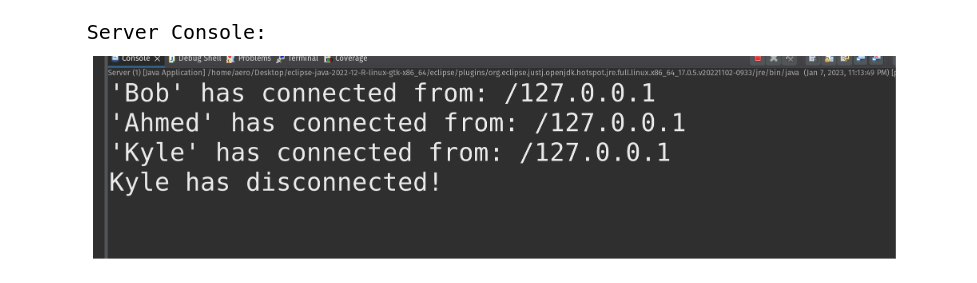

# JavaChatApp
Simple Socket Chat server that is built using Java and uses TLSv1.3 encryption and Certificate Authentication.

# How to use
Navigate into the src directory

Run the Server.java once for the server to start

In different terminals run as many Client.java as you need, you will have to provide a username and password , the password is "password"

The Client will then connect to the Server and can chat with all the other connected Clients.	

# Features

In class Server there is a String array called 'AllowedClients' , this array will only let it's stored IPs connect to the server, since we are running the server and clients locally , '127.0.0.1' is enough

Below is a screenshot of a Server terminal output, showing clients connecting , their IP and their chosen usernames.
It also show when a client disconnects.

